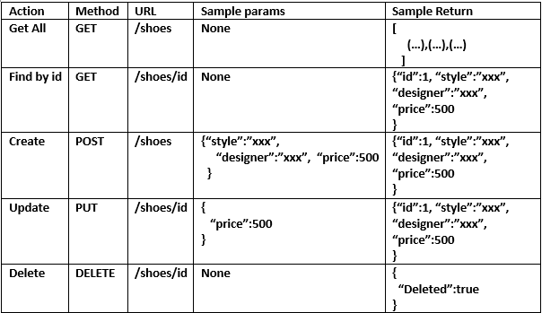

# Project submission for Data Representation 2019

The files contain the requirements for the Data Representation Project 2019.

The project comprises of a basic Flask server that has a Restful API that performs CRUD operations on a MySQL database for shoes. The web interface uses AJAX calls to perform the CRUD operations. The application is hosted on Python Anywhere at the following links:

http://graceakelly.pythonanywhere.com/shoes

http://graceakelly.pythonanywhere.com/shoeviewer.html

The project is based on a database of shoes with style, designer and price information included in a MySQL database.
The proposed interface as outlined below was used as an initial template in the designing of the database.

